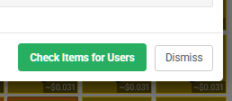
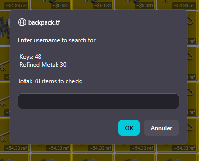
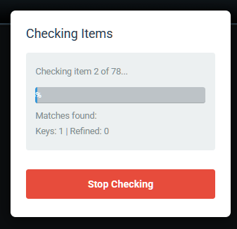
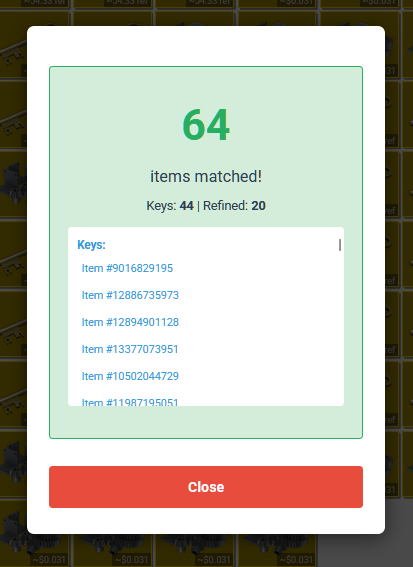

# key-refined-history-checker

Backpack.tf Key/Refined History Checker

## Install (one-click)

- Userscript (show price in keys): https://raw.githubusercontent.com/williambrooks84/key-refined-history-checker/main/key-refined-history-checker

## Quick install (Tampermonkey / Greasemonkey)

1. Install Tampermonkey (Chrome or Opera GX): https://www.tampermonkey.net/
2. Install Greasemonkey (Firefox): https://addons.mozilla.org/firefox/addon/greasemonkey/
3. Open the raw userscript URL above in your browser — Tampermonkey/Greasemonkey will prompt to install.

## Included scripts

- `key-refined-history-checker` — Shows key median and value-in-keys on Steam Market price history above the defauly overlay.

## Usage

- Go to the buyer's compare link of the sale you want.
- Click on the "Check the sale" button at the bottom of the compare.
- A modal will show, enter the name of the seller.
- On the right of your window a modal will show. It will indicate how many currency items have been detected and gradually show how many keys and refined match.
- Once the process is finished, the full sale will show.

## Auto-update for users

The scripts include `@updateURL` / `@downloadURL` referencing the raw GitHub files so Tampermonkey can auto-update when you bump `@version` and push changes.

## Demonstration of the script in use

  
  
  
  

---
Written and maintained by williambrooks84.